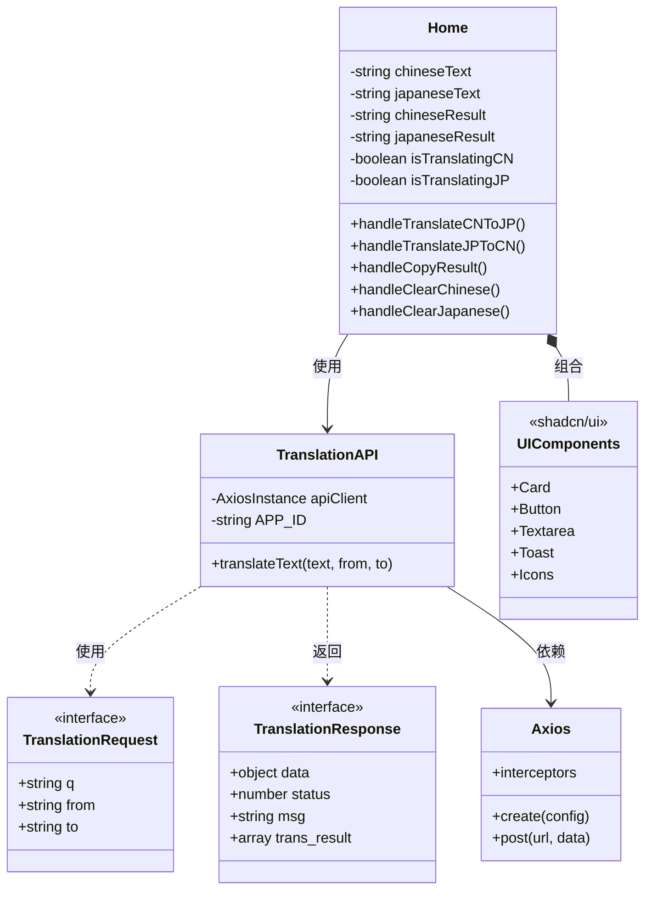
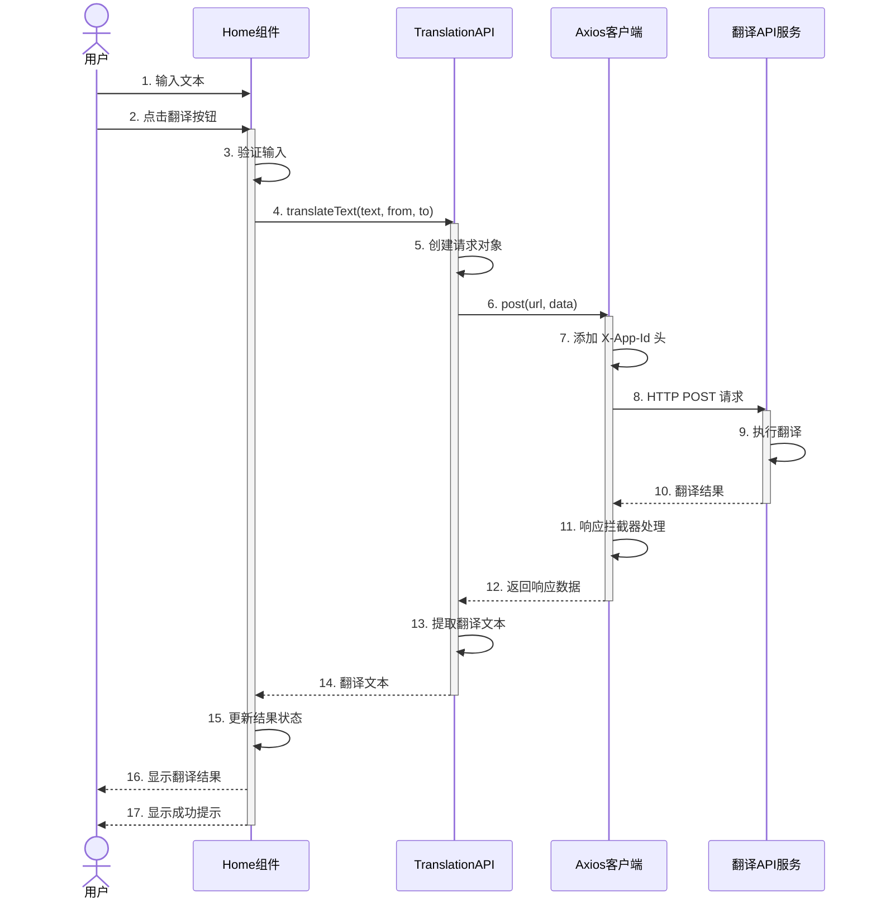
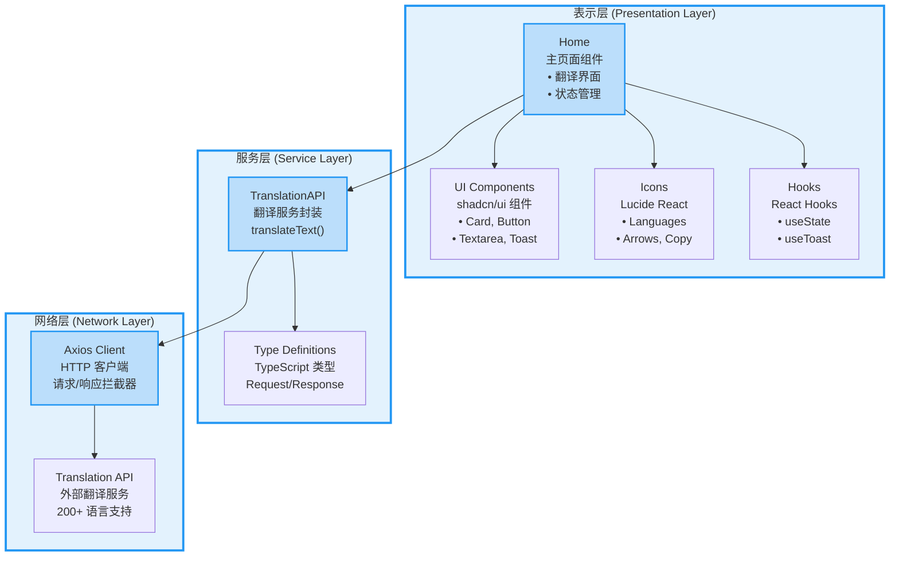
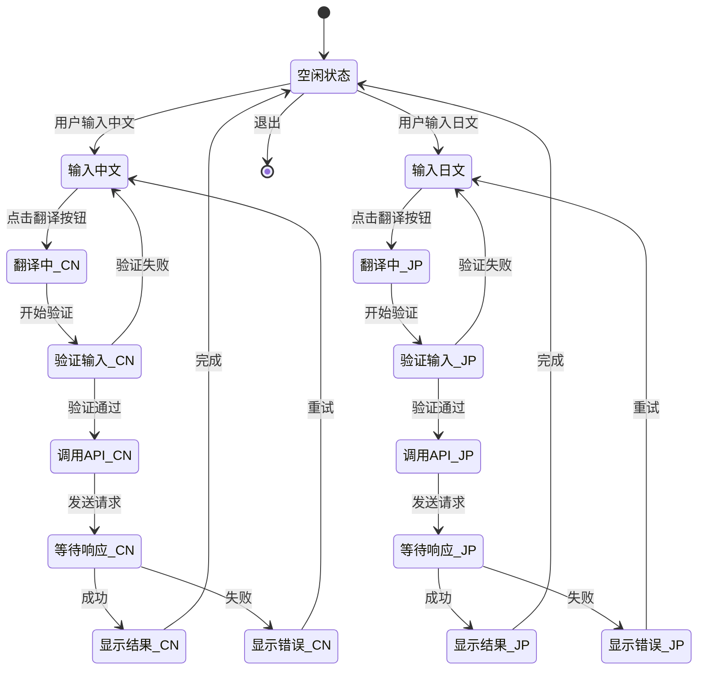
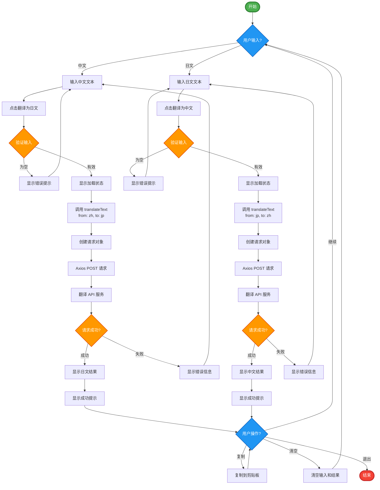
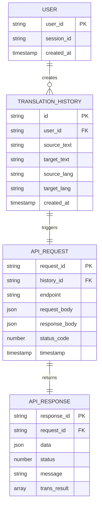

# 日文文本翻译工具 - Mermaid 图形示例

> 本文档展示如何在 GitHub Markdown 中使用 Mermaid 图形。所有代码都可以直接在应用的 `/mermaid` 页面复制。

## 📐 系统架构

### 类图 - 系统类结构

## 🔄 翻译流程

### 序列图 - 完整交互流程

## 🏗️ 系统分层

### 组件图 - 三层架构

## 🔀 状态管理

### 状态图 - 应用状态转换

## 📊 业务流程

### 流程图 - 完整翻译流程

## 💾 数据模型

### ER图 - 数据实体关系（可选功能）

## 📝 使用说明

### 如何使用这些图形

1. **复制代码**
   - 访问应用的 `/mermaid` 页面
   - 选择需要的图形类型
   - 点击 "复制代码" 按钮

2. **粘贴到 Markdown**
   - 在 GitHub 仓库中创建或编辑 `.md` 文件
   - 粘贴复制的代码
   - 保存文件

3. **查看渲染效果**
   - GitHub 会自动渲染 Mermaid 图形
   - 图形会以精美的可视化形式展示

### 支持的文件类型

- ✅ README.md
- ✅ CONTRIBUTING.md
- ✅ docs/*.md
- ✅ Issue 描述
- ✅ Pull Request 描述
- ✅ Wiki 页面
- ✅ Discussions
- ✅ Gist

## 🔗 相关资源

- [应用主页](/) - 日文翻译工具
- [SVG 图形](/uml) - 交互式 SVG UML 图形
- [Mermaid 代码](/mermaid) - 可复制的 Mermaid 代码
- [Mermaid 官方文档](https://mermaid.js.org/)
- [GitHub Mermaid 支持](https://github.blog/2022-02-14-include-diagrams-markdown-files-mermaid/)

## 💡 提示

- 所有图形代码都可以在应用中直接复制
- 支持在 GitHub、GitLab、Notion 等平台使用
- 可以在 [Mermaid Live Editor](https://mermaid.live) 中预览和编辑
- 图形会自动适应主题（亮色/暗色模式）

---

**注意：** 本文档中的所有 Mermaid 图形在 GitHub 上会自动渲染。如果您在其他平台查看，可能需要相应的 Mermaid 支持。
